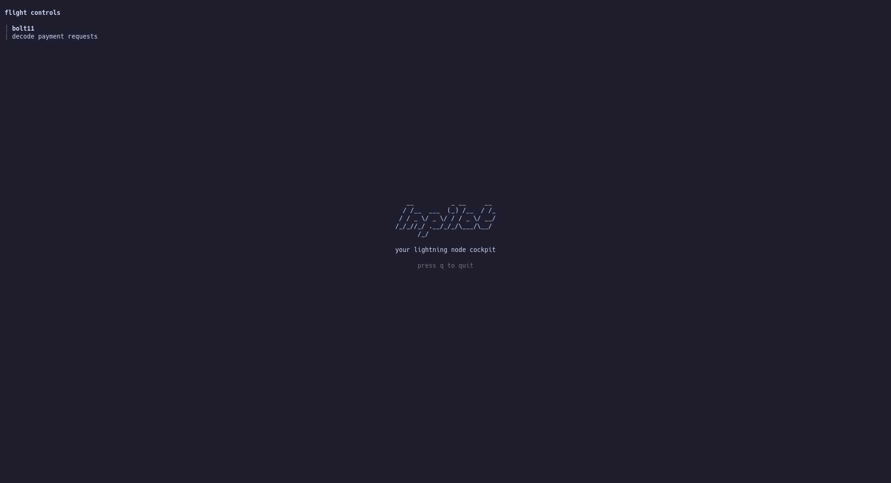

# lntutor

```
   __     __       __
  / /__  / /___ __/ /____  ____
 / / _ \/ __/ // / __/ _ \/ __/
/_/_//_/\__/\_,_/\__/\___/_/
```

toy lightning implementation |
[`vimtutor`](https://vimschool.netlify.app/introduction/vimtutor/) but for
lightning

## What is this??

I'm not sure yet, but [NOTES.md](./NOTES.md) should provide more information.

## How to Run

```
$ git clone git@github.com:ekzyis/lntutor
$ cd lntutor
$ go run .
```

You should then see this screen:



_The menu doesn't do anything yet, that's all there is for now._

To run the tests, run `make test` or `go test -v ./...` if you don't have `make`.

---

<sub>last updated: Jan 3, 2026</sub>
